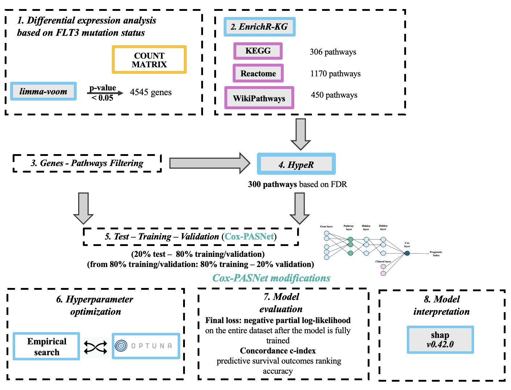

<a name="readme-top"></a>

<h3 align="center">CoxPASOpt:&nbsp;Cox‑PASNet&nbsp;Survival&nbsp;Analysis&nbsp;Workflow</h3>

<p align="center">
  A self‑contained repository for training, evaluating &amp; interpreting <strong>Cox‑PASNet</strong> models with either empirical or <em>Optuna</em>‑optimised hyperparameters, SHAP feature importance, and pathway enrichment via GSEApy.
</p>

---

<!-- WORKFLOW DIAGRAM -->
<p align="center">
  
</p>

---

<!-- ABOUT -->
This repository includes all files needed to run and interpret the CoxPASOpt model for survival analysis, using both empirical and Optuna-optimized hyperparameters. The workflow also includes SHAP-based feature importance and pathway enrichment analysis via GSEApy.

---


<!-- MANUAL SETUP -->
## Manual Setup

Set up the Python environment manually with <code>conda</code> &amp; <code>pip</code>:

```bash
# create & activate an isolated env
conda create -n my-env python=3.10
conda activate my-env

# install core packages
pip install jupyterlab openpyxl pandas==2.2.3 numba==0.56.4 numpy==1.23.5

# deep‑learning, optimisation & plotting
pip install torch==2.6.0 torchvision==0.21.0 torchaudio==2.6.0
pip install shap==0.42.0 optuna==4.2.0 matplotlib gseapy
 
```

## Files Overview

### Model Scripts (`./`)
- **surv_status_covariate_analysis.py** - End‑to‑end pipeline that trains Cox‑PASNet on the **survival‑status (single covariate)** dataset with both empirical and Optuna‑optimised hyper‑parameters, saves the best model, and generates SHAP.
- **dual_covariate_analysis.py** - Identical workflow, but uses the **Condition + Survival Status (dual covariate)** dataset.

### Config & Utility Files (`./configs/`)
- **data_utils.py** – functions for loading and preprocessing data.
- **data_metrics.py** – evaluation metrics (e.g. c-index).
- Additional utility functions for training, evaluation, and pathway analysis.

### Data Files (`./data/`)
- **TRAINING.xlsx**, **VALIDATION.xlsx**, **TEST.xlsx** – predefined splits.
- **TRAINING_condition.xlsx**, **VALIDATION_condition.xlsx**, **TEST_condition.xlsx**  
  → The same splits as above, but with an **additional `Condition` covariate**. Used for dual-covariate models (Condition + Survival Status).
- **entire_data.xlsx** – full cohort used across experiments.
- **entire_data_condition.xlsx**  
  → Full dataset used for **Condition + Survival Status** models, includes the `Condition` column.
- **pt.xlsx** – gene‑to‑pathway mapping used to build the pathway mask.

### Output Files (Auto‑generated in `./outputs/`)
- **lin_pred.csv** – prognostic index (risk scores) per sample.
- **pathway_node.csv** – pathway activation scores for each patient.

<p align="right">(<a href="#readme-top">back to top</a>)</p>
